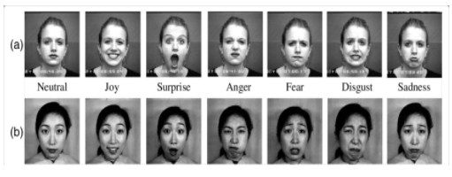

# Facial-Emotion-Analysis-Neural-Networks-AAT
Automated facial expression recognition has been proven to greatly improve the human–machine interface. Automatic facial expression recognition is an actively emerging research in Emotion Recognition. A large number of deep learning approaches have been applied in recent years due to their outstanding recognition accuracy which can be attained after training the model with large amounts of data. This research paper throws light on how to enhance Convolutional Neural Network method to recognize 6 basic emotions and compare some pre-processing methods to show its influences on the performance. The preprocessing methods are :
1.resizing
2.mean 
3.normalization
4.standard deviation
5.scaling 
6.edge detection

